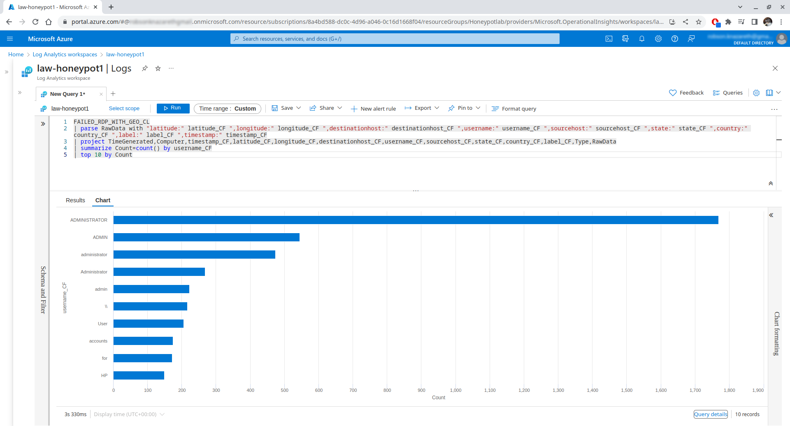

<<<<<<< HEAD

# Attack Monitoring with Microsoft Sentinel (SIEM)

The purpose of this lab is to utilize Microsoft Sentinel to keep track of unsuccessful Remote Desktop Protocol (RDP) login attempts made by attackers worldwide on an exposed Windows 10 virtual machine set up in Microsoft Azure. The failed login events and geolocation data are extracted using a PowerShell script on the virtual machine, processed using the Log Analytics Workspace on Microsoft Azure, and visualized in Microsoft Sentinel on Microsoft Azure.

## Outline

1. [Procedure](#procedure)
2. [Diagram](#diagram)
3. [Setup Overview](#setup-overview)
	1. [Microsoft Azure](#microsoft-azure)
4. [Azure Log Analytics and Microsoft Sentinel](#azure-log-sentinel)
	1. [Azure Log Analytics Workspace](#azure-log-analytics-workspace)
	2. [Mirosoft Sentinel](#microsoft-sentinel)

----------------------------------------------------------------------------------------------------
=======
The objective of this lab is to employ Microsoft Sentinel for monitoring unsuccessful Remote Desktop Protocol (RDP) login attempts globally. These attempts are made by attackers worldwide on an exposed Windows 10 virtual machine set up in Microsoft Azure. A PowerShell script on the virtual machine extracts failed login events and geolocation data. This information is then processed in the Log Analytics Workspace on Microsoft Azure and visualized within Microsoft Sentinel on the same platform.

## Summary
- Microsoft Sentinel was utilized to monitor repeated failed RDP login attempts originating from global attackers targeting an exposed Windows 10 virtual machine within Microsoft Azure.
- To achieve this, a dedicated log file (`failed_rdp.log`) was generated through a PowerShell script. This script extracted instances of failed login events from the Security Log in Event Viewer. Subsequently, the attacker's IP address extracted is sent to a third-party API to retrieve geolocation data.
- Within the Microsoft Azure Log Analytics Workspace, a custom table (`FAILED_RDP_WITH_GEO_CL`) was established. The table was populated with pertinent fields extracted from the aforementioned log file (`failed_rdp.log`) using a Kusto Query Language (KQL) query.
- To visualize this data effectively, a specialized workbook was created within Microsoft Sentinel. This workbook employed KQL queries to extract and display information from the `FAILED_RDP_WITH_GEO_CL` table. This visualization showcased global attackers involved in RDP login failures on a world map. The map indicated the physical locations of these attacks and their magnitudes (attack count).
>>>>>>> d4295af58285aa413ee86f124179e1fcfbcb2dd8

## Procedure
<<<<<<< HEAD

The procedures to build this lab can be found [here](https://github.com/robsann/AzureSentinelSIEMAttackMap/blob/main/procedure.md), and it was adapted from [Josh Madakor](https://www.youtube.com/watch?v=RoZeVbbZ0o0&t=1544s&ab_channel=JoshMadakor-Tech%2CEducation%2CCareer).
=======
The procedures to build this lab can be found [here](https://github.com/robsann/AzureSentinelSIEMAttackMap/blob/main/procedure.md). It was adapted from [Josh Madakor](https://www.youtube.com/watch?v=RoZeVbbZ0o0&t=1544s&ab_channel=JoshMadakor-Tech%2CEducation%2CCareer).
>>>>>>> d4295af58285aa413ee86f124179e1fcfbcb2dd8

## Diagram

<<<<<<< HEAD
----------------------------------------------------------------------------------------------------

<h1 align="center" id="setup-overview">Setup Overview</h1>

## Microsoft Azure

This lab uses Microsoft Azure, which is a cloud computing platform that offers a wide range of services for building, deploying, and managing applications and services through Microsoft's global network of data centres. It provides tools and resources for businesses to scale and grow their operations in a secure and reliable environment.

<h3>The Virtual Machine on Microsoft Azure</h3>

### The Virtual Machine Configuration

Here is the information about the virtual machine created on Microsoft Azure. The virtual machine was named `honeypot-vm` and runs the Windows 10 operating system. Information about the virtual machine can be found on this screen, such as the computer name, operating system, public and private IP addresses, and the hardware used. Furthermore, the virtual machine can be accessed via RDP.

### The Windows Defender Firewall Disabled

The Windows Defender Firewall of the Windows 10 virtual machine was turned off for the Domain, Private, and Public profiles, allowing connections from outside.
=======
### 1.1 - The Virtual Machine Configuration
Here is the information regarding the virtual machine established on Microsoft Azure. The virtual machine, named `honeypot-vm`, operates on the Windows 10 operating system. Details about this virtual machine are available on this screen, including the computer name, operating system, public and private IP addresses, and hardware specifications. Additionally, access to the virtual machine is possible through RDP.

### 1.2 - The Windows Defender Firewall Disabled
The Windows Defender Firewall on the Windows 10 virtual machine was disabled for the Domain, Private, and Public profiles, permitting external connections.
>>>>>>> d4295af58285aa413ee86f124179e1fcfbcb2dd8

<h3>The PowerShell Script</h3>

### The PowerShell Script Main Sections

<<<<<<< HEAD
Here are some chunks of the PowerShell script utilized to retrieve unsuccessful login events from the Security Log in Event Viewer. The retrieved IP address is then sent to a third-party API to get geolocation information that will be combined with the event details to create a custom log file.

#### XML Filter

The XML filter used on the PowerShell script to filter failed login events (ID = 4625) on Event Viewer.
=======
### 2.1 - The PowerShell Script Main Sections
Below are various segments of the PowerShell script used to fetch unsuccessful login events from the Security Log within Event Viewer. The acquired IP address is subsequently transmitted to a third-party API to obtain geolocation information. This information, along with event details, is then merged to generate a customized log file.

#### XML Filter
The XML filter utilized in the PowerShell script filters failed login events (Event ID = 4625) in the Event Viewer.
>>>>>>> d4295af58285aa413ee86f124179e1fcfbcb2dd8

#### Event Viewer Log Gathering
<<<<<<< HEAD

This section of the code extracts fields from the events filtered from the Security Log in Event Viewer by the XML filter.
=======
In this section of the code, fields are extracted from the events filtered from the Security Log in Event Viewer using the XML filter.
>>>>>>> d4295af58285aa413ee86f124179e1fcfbcb2dd8

#### API Data Gathering
<<<<<<< HEAD

The IP address extracted from the Security Log in Event Viewer was used to make web requests to the geolocation API.

### The PowerShell Script Extracting Failed Login Attempts

Below is the PowerShell ISE, with the PowerShell script used to extract failed login attempts from Security Log in Event Viewer running and outputting to the terminal the detected failed login attempts. At the right is an example of a failed login attempt event on Event Viewer. Some relevant fields are `Account Name`, the used username, `Source Network Address`, the attacker IP address, `Event ID`, `Logged`, and `Computer`.

### The Custom Log File Generated by the PowerShell Script

This text file is the custom log file (`failed_rdp.log`) generated by the PowerShell script. It has information about the failed RDP login attempt, such as the username attempted, the source IP address and the geolocation data gathered using the IP address. It is the file that is ingested by Log Analytics Workspace on Microsoft Azure.

----------------------------------------------------------------------------------------------------

<h1 align="center" id="azure-log-sentinel">Azure Log Analytics and Microsoft Sentinel</h1>

## Azure Log Analytics Workspace

Azure Log Analytics Workspace is a centralized repository for collecting, analysing, and visualizing log data from various sources within the Azure ecosystem. It provides insights into system performance, security threats, and operational efficiency for better decision-making.

<h3>The Log Analytics Workspace Custom Table on Microsoft Azure</h3>

The `failed_rdp.log` was imported in real-time from the virtual machine, and its content was stored in the `RawData` field of the created `FAILED_RDP_WITH_GEO_CL` table. A KQL query was used to extract the data from the `RawData` field and create new fields on the `FAILED_RDP_WITH_GEO_CL` table, named according to the extracted data.

## Microsoft Sentinel

Microsoft Sentinel is a cloud-native security information and event management (SIEM) service that helps organizations detect, investigate, and respond to threats across their entire environment. It provides intelligent security analytics and threat intelligence to help protect against cyberattacks.

<h3>The Microsoft Sentinel Map on Microsoft Azure</h3>

The visualization of failed RDP login attempts on the world map was created on Microsoft Sentinel. The attackers' IP address and geolocation (latitude, longitude, and country) were obtained from the `FAILED_RDP_WITH_GEO_CL` table using a KQL query.

### After 1 Hour of Exposure.

During the first hour, two failed RDP login attempts were registered from me and three from the United Kingdom.

### After 24 Hours of Exposure

After 24 hours of exposure, the virtual machine had 844 failed RDP login attempts from India, 447 from Palestine, 338 from Japan, and 533 from other countries.

### After 48 Hours of Exposure

Over a 48-hour period, there were a significant number of failed RDP login attempts on the virtual machine, originating from various countries. There were 1.75k failed attempts from the Netherlands, 1.05k from Pakistan, 844 from India, and 3.09k from other countries.

### The Top 10 Usernames Used by Attackers

This bar plot displays the top 10 usernames most frequently used by attackers, obtained from the `FAILED_RDP_WITH_GEO_CL` table through a KQL query. The most commonly used username is `ADMINISTRATOR`, followed by `ADMIN`, `administrator`, `Administrator`, and `admin`.
=======
The IP address, extracted from the Security Log within Event Viewer, was utilized to initiate web requests to the geolocation API.

### 2.2 - The PowerShell Script Extracting Failed Login Attempts
Below is the PowerShell ISE, with the PowerShell script used to extract failed login attempts from the Security Log in Event Viewer running and outputting to the terminal the detected failed login attempts. On the right is an example of a failed login attempt event in Event Viewer. Some relevant fields are `Account Name`, which shows the used username, `Source Network Address`, indicating the attacker's IP address, `Event ID`, `Logged`, and `Computer`.

### 2.3 - The Custom Log File Generated by the PowerShell Script
This text file, named `failed_rdp.log`, is the custom log file created by the PowerShell script. It contains details about unsuccessful RDP login attempts, including the attempted username, source IP address, and geolocation data obtained from the IP address. This file is processed by the Log Analytics Workspace on Microsoft Azure.

## 3 - The Log Analytics Workspace Custom Table on Microsoft Azure
The `failed_rdp.log` file was imported in real-time from the virtual machine. Its contents were stored in the `RawData` field of the newly created `FAILED_RDP_WITH_GEO_CL` table. Using a KQL query, new fields were created on the `FAILED_RDP_WITH_GEO_CL` table by extracting data from the `RawData` field, which stores all the `failed_rdp.log` data.

## 4 - The Microsoft Sentinal Map on Microsoft Azure
The Microsoft Sentinel platform was used to visualize unsuccessful Remote Desktop Protocol (RDP) login attempts worldwide. This visualization involved retrieving the attackers' IP addresses and geolocation data (latitude, longitude, and country) from the `FAILED_RDP_WITH_GEO_CL` table through a Kusto Query Language (KQL) query.

### 4.1 - After 1 Hour of Exposure.
During the initial hour, there were two unsuccessful RDP login attempts made by me and three made by individuals from the United Kingdom.

### 4.2 - After 24 Hours of Exposure
After 24 hours of exposure, the virtual machine experienced 844 unsuccessful RDP login attempts from India, 447 from Palestine, 338 from Japan, and 533 from various other countries.

### 4.3 - After 48 Hours of Exposure
Over a span of 48 hours, there was a notable surge in unsuccessful RDP login efforts on the virtual machine, originating from different countries. Specifically, there were 1.75k failed attempts from the Netherlands, 1.05k from Pakistan, 844 from India, and 3.09k from diverse other countries.

### 4.4 - The Top 10 Usernames Used by Attackers
The bar plot illustrates the top 10 usernames frequently utilized by attackers, extracted from the `FAILED_RDP_WITH_GEO_CL` table via a KQL query. The most prevalent username is `ADMINISTRATOR`, succeeded by `ADMIN`, `administrator`, `Administrator`, and `admin`.
>>>>>>> d4295af58285aa413ee86f124179e1fcfbcb2dd8

