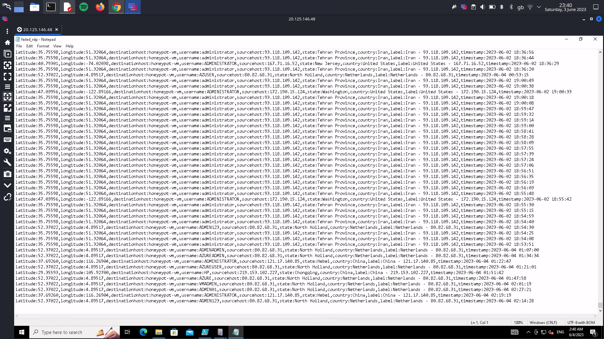
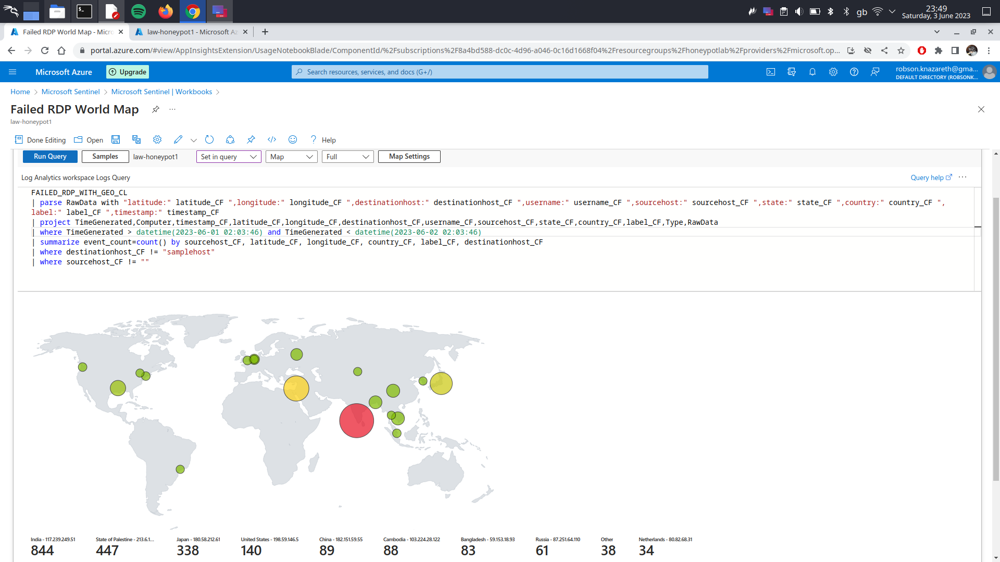
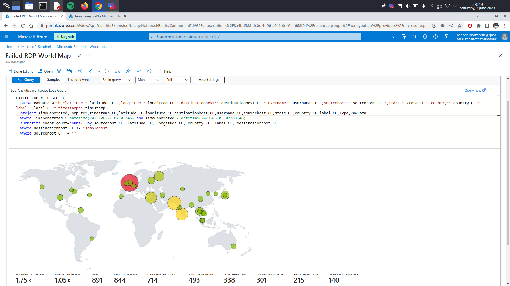

## Azure Sentinel (SIEM) Attack Map
- Configured an exposed Windows 10 VM in Azure to monitor failed RDP login attempts from Global Attackers using Azure Sentinel (SIEM).
- Configured a Windows 10 VM with Firewall disabled and RDP (3389) port open and used a custom PowerShell script to extract metadata from Windows Event Viewer and forward it to a 3rd party API to get geolocation data.
- Configured a custom log on Log Analytics workspaces on Azure to ingest custom logs containing geographic information (latitude, longitude, state, and country) and extracted the fields using Kusto Query Language (KQL) to map geo data into Azure Sentinel.
- Configured an Azure Sentinel (SIEM) workbook to display global attack data (failed RDP login attempts) on the world map according to physical location and magnitude (count) of attacks.

The procedures to build this lab can be found [here](https://github.com/robsann/AzureSentinelSIEMAttackMap/blob/main/procedure.md).

This lab was adapted from [here](https://www.youtube.com/watch?v=RoZeVbbZ0o0&t=1544s&ab_channel=JoshMadakor-Tech%2CEducation%2CCareer).

## Highlighs
### Lab Diagram

### 1. Windows 10 VM on Microsoft Azure.

### 1. Windows Defender Firewall disabled.

### 3. PowerShell script extracting failed log attempts from Event Viwer.

#### 3a. XML filter used by th PowerShell script to filter events on Event Viwer.

#### 3b. Event Viwer log gathering.

#### 3c. API data gathering.

### 4. The PowerShell script output, `failed_rdp.log`, that will be ingested by Log Analytics Workspace on Microsoft Azure.

### 5. Log Analytics Workspace querying using KQL the `failed_red.log` that is imported in real-time from the VM.

### 6. Microsoft Sentinal map visualization of the failed RDP login attempts using KQL to query the data.
#### 6a. After 1 hour of exposure.

#### 6b. After 24 hours of exposure.

#### 6c. After 48 hours of exposure.

