## Microsoft Sentinel (SIEM) Attack Map
### Overview
- Configured an exposed Windows 10 VM in Microsoft Azure to monitor failed RDP login attempts from Global Attackers using Microsoft Sentinel (SIEM).
- Windows 10 VM has Firewall disabled and RDP port (3389) open. A custom PowerShell script extracted failed login events from the Event Viewer's Security Log, forwarded them to a third-party API to get geolocation data, and generated a log file (`failed_rdp.log`) with geolocation and event data.
- Created a custom table (`FAILED_RDP_WITH_GEO_CL`) in Log Analytics Workspace on Microsoft Azure, using `failed_rdp.log` and containing geographic information (latitude, longitude, state, and country) and event information (workstation name, account name, and IP address ), and queried the table to extract the custom fields from RawData using Kusto Query Language (KQL).
- Configured a Microsoft Sentinel (SIEM) workbook to display Global Attackers' data (failed RDP login attempts) on the world map according to physical location and magnitude (count) of attacks using Kusto Query Language (KQL) to query the data from the `FAILED_RDP_WITH_GEO_CL` table.

The procedures to build this lab can be found [here](https://github.com/robsann/AzureSentinelSIEMAttackMap/blob/main/procedure.md). This lab was adapted from [here](https://www.youtube.com/watch?v=RoZeVbbZ0o0&t=1544s&ab_channel=JoshMadakor-Tech%2CEducation%2CCareer).

### Lab Diagram
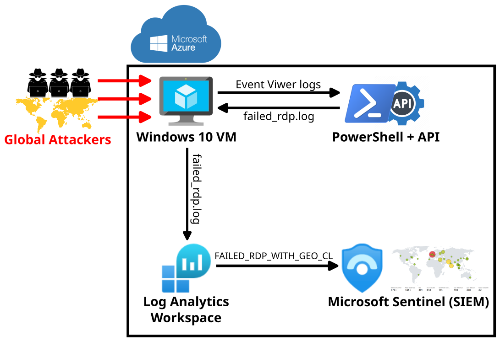

## Highlighs
### 1. Windows 10 VM on Microsoft Azure that can be accessed using RDP.
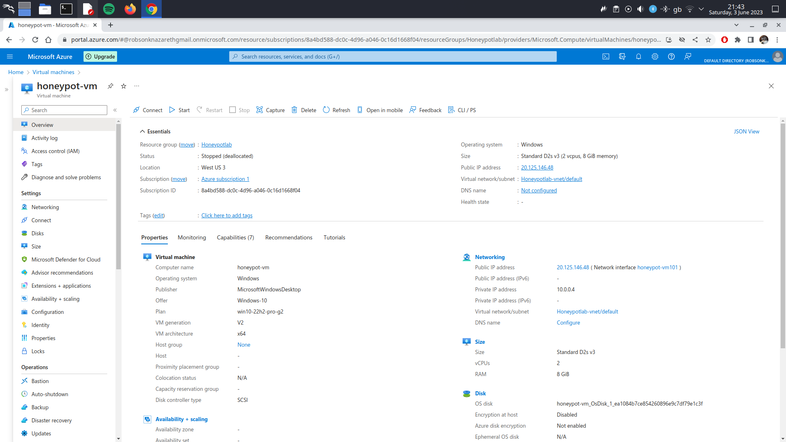

### 1. Windows Defender Firewall disabled.
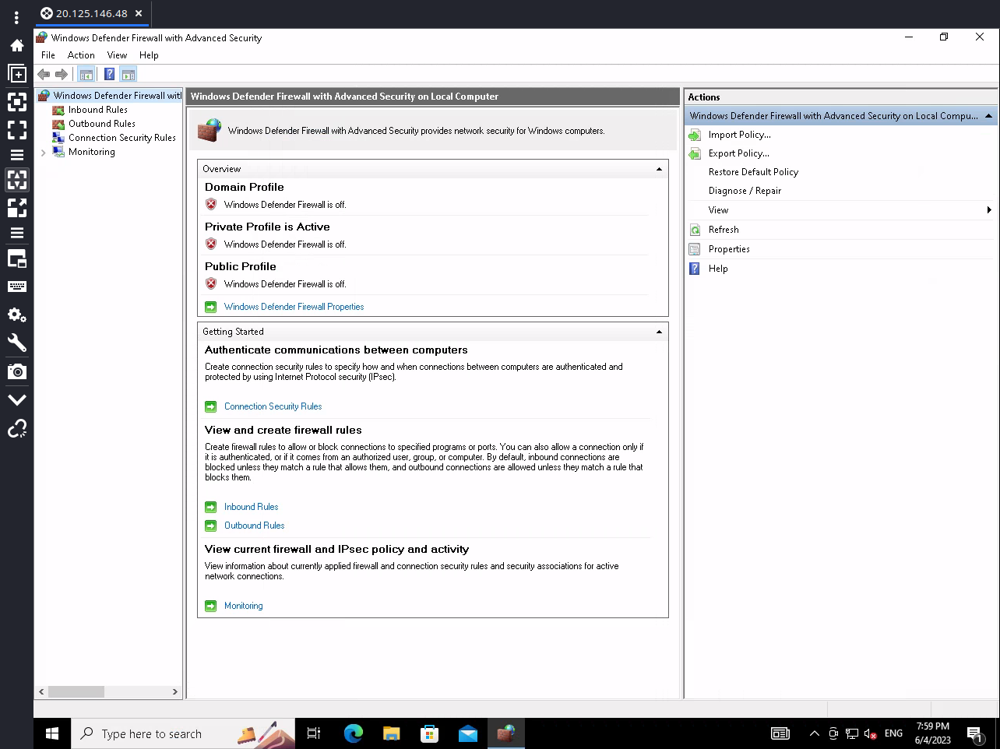

### 3. PowerShell script extracting failed login attempts from Event Viwer.
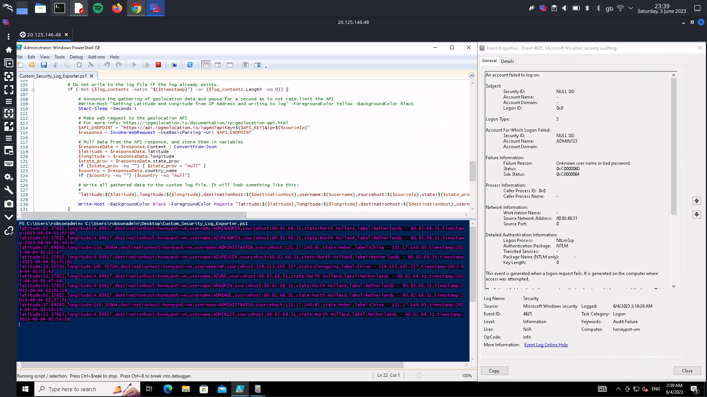

#### 3a. XML filter used by th PowerShell script to filter events on Event Viwer.
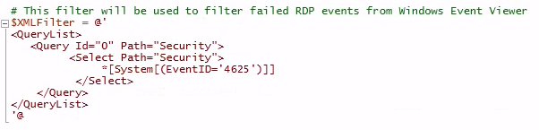

#### 3b. Event Viwer log gathering.
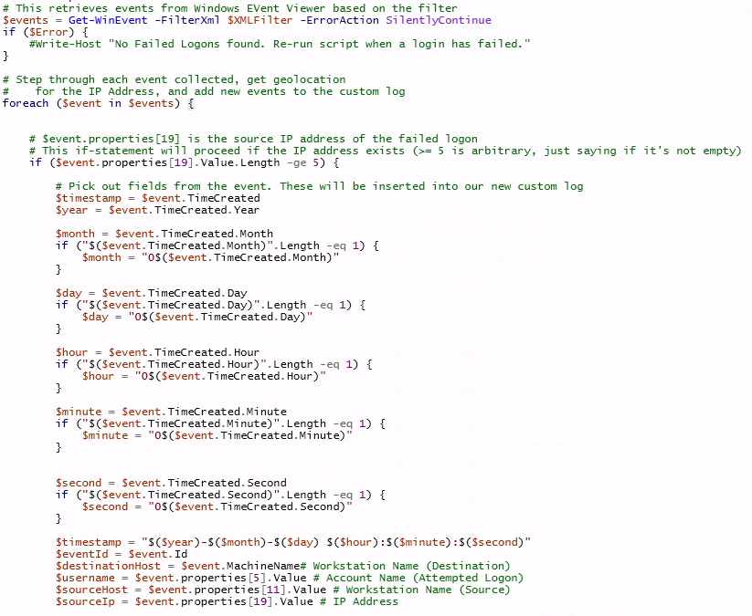

#### 3c. API data gathering.
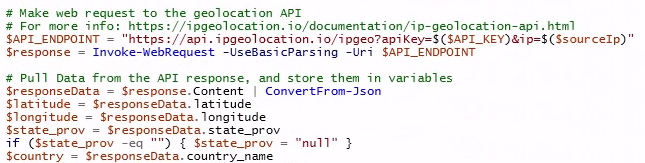

### 3d. The PowerShell script output, `failed_rdp.log`, that will be ingested by Log Analytics Workspace on Microsoft Azure.
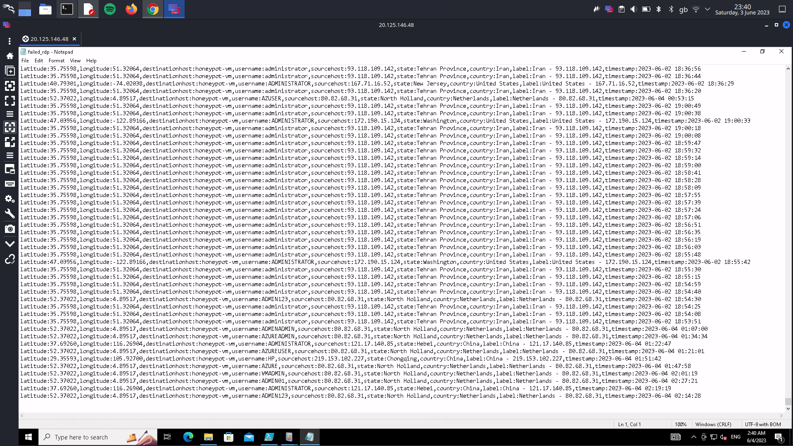

### 4. Log Analytics Workspace using KQL to query the data from the table `FAILED_RDP_WITH_GEO_CL` created using `failed_rdp.log` that is imported in real-time from the VM.
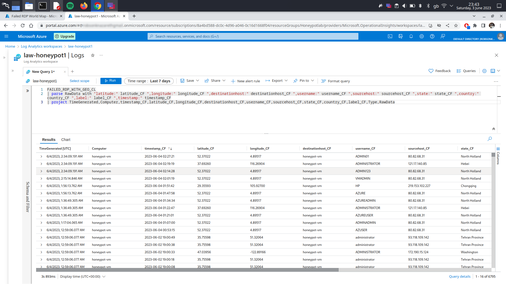

### 5. Microsoft Sentinal map visualization of the failed RDP login attempts using KQL to query the data from the table `FAILED_RDP_WITH_GEO_CL`.
#### 5a. After 1 hour of exposure.
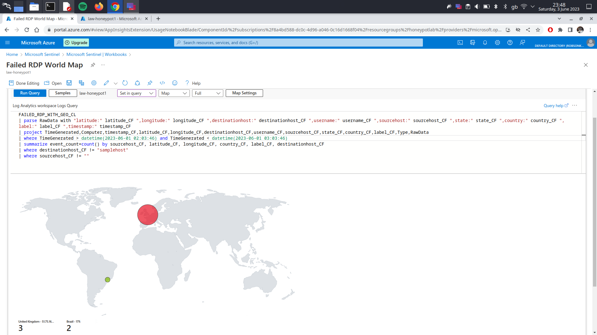

#### 5b. After 24 hours of exposure.

#### 5c. After 48 hours of exposure.
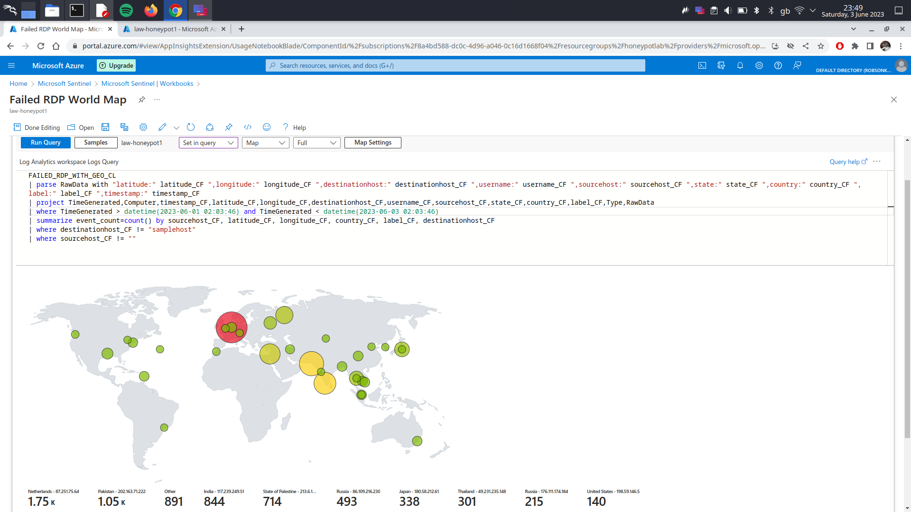
